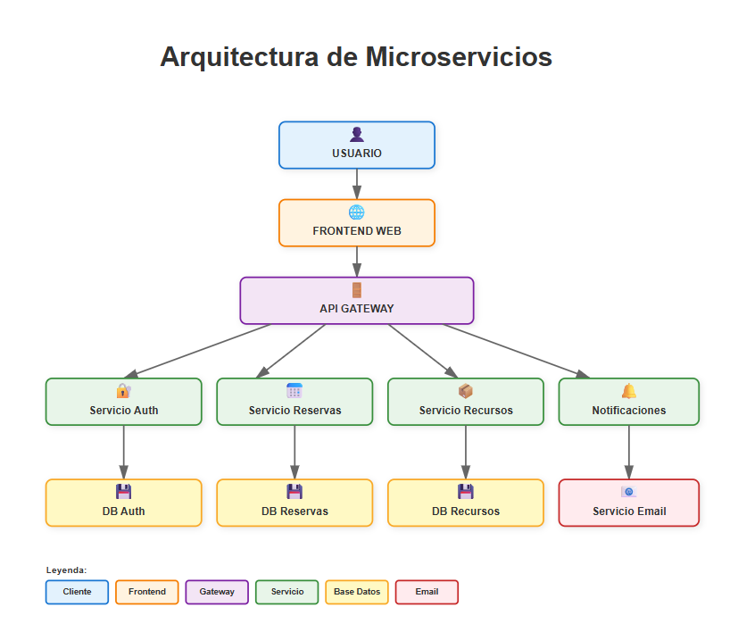

# Sistema de Reservas en la Nube  
## Diseño y Arquitectura de Microservicios

---

## 1. Contexto del proyecto

Este proyecto corresponde al diseño de la arquitectura de un **sistema de reservas en la nube**, solicitado por un equipo de desarrollo de una empresa tecnológica.  
El sistema debe permitir a los usuarios **crear, consultar y cancelar reservas en tiempo real**, manteniendo un buen rendimiento incluso ante picos de demanda, y garantizando la seguridad de la información.

El foco principal del trabajo está en la **arquitectura de la solución**, más que en la implementación de código, priorizando decisiones de diseño alineadas con buenas prácticas de la industria.

---

## 2. Problema a resolver

El principal desafío es construir un sistema que:

- Soporte múltiples usuarios concurrentes sin degradar el rendimiento  
- Sea fácil de escalar cuando aumenta la carga  
- Permita cambios futuros sin afectar la estructura principal  
- Proteja los datos de los usuarios desde el diseño  

Una arquitectura monolítica dificultaría el crecimiento, el mantenimiento y la adaptación a nuevos requerimientos. Por esta razón, se opta por un enfoque moderno y desacoplado.

---

## 3. Enfoque arquitectónico elegido

La solución se basa en una **arquitectura de microservicios**, donde el sistema se divide en servicios pequeños, independientes y especializados.

Este enfoque fue elegido porque permite:

- Escalar solo los componentes que lo necesitan  
- Reducir el impacto de fallos  
- Facilitar el mantenimiento y la evolución del sistema  
- Mejorar la organización del trabajo entre equipos  

Cada microservicio tiene una responsabilidad clara y se comunica con el resto de forma controlada.

---

## 4. Descripción general de la arquitectura

El flujo principal del sistema es el siguiente:

1. El usuario interactúa con una aplicación web (frontend).
2. El frontend envía las solicitudes a un único punto de entrada.
3. Un API Gateway recibe y redirige las solicitudes.
4. Los microservicios procesan la lógica de negocio.
5. Cada servicio gestiona su propia base de datos o recurso asociado.

Esta separación permite mantener el sistema ordenado, seguro y escalable.

---

## 5. Componentes principales

### Frontend Web

El frontend es responsable únicamente de la interacción con el usuario.

- No contiene lógica de negocio crítica.
- No accede directamente a bases de datos.
- Consume las APIs expuestas por el backend.

Esta decisión mejora la seguridad y permite modificar la interfaz sin afectar la lógica interna del sistema.

---

### API Gateway

El API Gateway actúa como la **puerta de entrada única** al backend.

Sus funciones principales son:

- Recibir todas las solicitudes del frontend.
- Redirigir cada petición al microservicio correspondiente.
- Centralizar controles de acceso y validaciones iniciales.

Esta capa evita accesos directos a los servicios internos y simplifica la gestión del sistema.

---

### Servicio de Autenticación

Este microservicio se encarga exclusivamente de la gestión de usuarios.

Responsabilidades:

- Registro y autenticación.
- Emisión y validación de tokens.
- Control de identidad.

Cuenta con su propia base de datos, lo que permite reforzar la seguridad sin impactar otros servicios.

---

### Servicio de Reservas

Es el núcleo funcional del sistema.

Responsabilidades:

- Crear reservas.
- Consultar reservas existentes.
- Cancelar reservas.

Al estar desacoplado, este servicio puede escalar de forma independiente cuando aumenta la demanda, por ejemplo en horarios de alta concurrencia.

---

### Servicio de Recursos

Gestiona los espacios o recursos disponibles para reservar.

Responsabilidades:

- Controlar disponibilidad.
- Evitar conflictos o duplicidad de reservas.
- Mantener consistencia de datos.

Separar este servicio del de reservas reduce la complejidad y mejora la mantenibilidad.

---

### Servicio de Notificaciones

Este servicio se encarga del envío de correos o notificaciones al usuario.

Características clave:

- Funciona de manera independiente.
- Se integra con un servicio externo de email.
- No bloquea el flujo principal del sistema.

Si este servicio falla, el sistema de reservas sigue funcionando correctamente.

---

## 6. Gestión de datos

Cada microservicio administra su **propia base de datos**.

Este diseño evita dependencias innecesarias y permite:

- Mayor seguridad.
- Mejor control de accesos.
- Escalabilidad independiente.

No existe acceso directo entre bases de datos de distintos servicios.

---

## 7. Seguridad desde la arquitectura

La seguridad fue considerada desde el diseño inicial:

- Autenticación centralizada.
- Comunicación controlada a través del API Gateway.
- Aislamiento de datos por servicio.
- Preparación para cifrado de datos en tránsito y en reposo.

Este enfoque reduce la superficie de ataque y sigue el principio de mínimo privilegio.

---

## 8. Escalabilidad y rendimiento

La arquitectura permite:

- Escalado horizontal de microservicios.
- Priorización de servicios críticos.
- Respuesta eficiente ante picos de demanda.

El sistema puede crecer sin necesidad de rediseñar la estructura principal.

---

## 9. Enfoque de pruebas

Desde el punto de vista arquitectónico se contemplan:

- Pruebas unitarias por microservicio.
- Pruebas de carga para validar el comportamiento bajo alta concurrencia.

Esto permite detectar problemas de rendimiento antes de llegar a producción.

---

## 10. Conclusión

La arquitectura propuesta resuelve el problema planteado de forma sólida y escalable, priorizando:

- Separación clara de responsabilidades.
- Seguridad desde el diseño.
- Facilidad de mantenimiento.
- Capacidad de evolución.
,
Esta solución refleja un enfoque donde la arquitectura no solo responde a los requerimientos actuales, sino que está preparada para el crecimiento y la adaptación futura.

La solución fue **diseñada y documentada por Nathalie Carrasco**, como parte de su portafolio profesional en arquitectura cloud y sistemas escalables.
